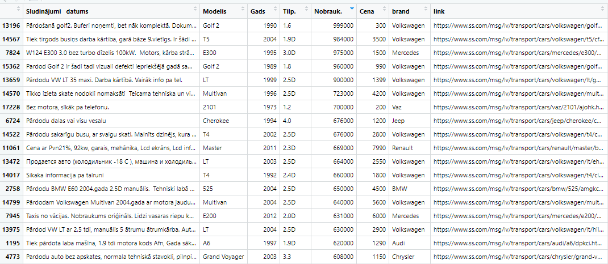

### Cars marker analytics
This small script helps to increase the experience of R, R-Shiny, JS and site scalping.

The idea comes when I looked for buying a car, but was struggling with the variety of cars in the market and was not certain whether or not the price was fair for a particular car. Since I have some data analysis background I decided to practice web scalping to make an analytical tool and visualize the Latvian market.

#### Make a famous site parser
We have an advertising site where people used to sell cars. So it has quite big data for analysis. These two libraries which analytics uses in R to parse sites:
* **RSelenium**
 
For the sake of simplicity, I decided to gather initial statistics with **Rvest** library. But initially, i played with Docker and **RSelenium**, so small instructions how to run **RSelenium**:
> * install docker
> * run it, restart the computer as requested
> * pull image by running in command line: **`docker pull selenium/standalone-firefox`**(or chrome instead of firefox) or in R **`shell('docker pull selenium/standalone-firefox')`**
> * start server by running in command line: **`docker run -d -p 4445:4444 selenium/standalone-firefox`** or in R **`shell('docker run -d -p 4445:4444 selenium/standalone-firefox')`**
> * Then run **`remDr <- remoteDriver(remoteServerAddr = "localhost", port = 4445L, browserName = "firefox'")`**

So on **`localhost:4445`** I managed to open the session and open a page of the site.
I found it useful but not for my case, since I need just basic data which can be extracted much easier than with **RSelenium**

* **RVest**  

I am quite familiar with this package so I used this instead. Small code which returns brands and the link is:
```R
data_brands <- read_html("https://www.ss.com/lv/transport/cars/sell/filter/") %>%
   html_elements('.category') %>% {.[1:40]}
# make a dataframe with a link and the name of the brand
check_data <- data.frame(
        brand = data_brands %>% html_text2(),
        link = 
            paste0('https://www.ss.com/',data_brands %>% html_elements('a') %>% html_attr('href'))
        )
```
This code creates an initial data frame to use in a loop.

The next part is to make a parser:
```R
total_data <- data.frame()
# for each brand I go through pages
for (brand in c(1:nrow(check_data))) {
  Sys.sleep(5)
  print(check_data$brand[brand])
  link <- check_data$link[brand]
  # randomly chosen page, if .navia class is not the same as the number of the page then break
  for (page in c(1:100)) {
    Sys.sleep(3)
    page_link <- paste0(link,"page",page,".html")
    print(page_link)
    navia_num <- read_html(page_link)
    page_num <- navia_num  %>%
      html_elements('.navia') %>% html_text2()
    # if there is only 1 page, then we set it to loop only first page.
    page_num <- ifelse(identical(page_num,character(0)), 1, page_num)
    
    if (page_num != page) {
      break
    } else {
      t_data <- navia_num %>%
        html_nodes(xpath = '//*[@id="filter_frm"]/table[2]') %>% 
        html_table() %>% 
        as.data.frame() %>%
        select(c(2:8)) %>%
        select(-1) %>%
        row_to_names(row_number=1) %>%
        slice(1:(n()-1)) %>%
        mutate(brand = check_data$brand[brand])
      
      total_data <- bind_rows(total_data, t_data)
      rm(t_data)
    }

  }
}
```
It will go to each car brand and take the list of cars. Since the site has pages and I cannot extract the total number per brand (not that easy with **RVest**, no problem with **RSelenium** though) I need that it will go to each page and once it reaches the last page it breaks **<code>if (page_num != page) {break}</code>**

So the log will be like this:
```log
[1] "Chevrolet"
[1] "https://www.ss.com//lv/transport/cars/chevrolet/sell/page1.html"
[1] "https://www.ss.com//lv/transport/cars/chevrolet/sell/page2.html"
[1] "https://www.ss.com//lv/transport/cars/chevrolet/sell/page3.html"
[1] "https://www.ss.com//lv/transport/cars/chevrolet/sell/page4.html"
[1] "Chrysler"
[1] "https://www.ss.com//lv/transport/cars/chrysler/sell/page1.html"
[1] "https://www.ss.com//lv/transport/cars/chrysler/sell/page2.html"
[1] "https://www.ss.com//lv/transport/cars/chrysler/sell/page3.html"
[1] "https://www.ss.com//lv/transport/cars/chrysler/sell/page4.html"
[1] "https://www.ss.com//lv/transport/cars/chrysler/sell/page5.html"
[1] "https://www.ss.com//lv/transport/cars/chrysler/sell/page6.html"
[1] "https://www.ss.com//lv/transport/cars/chrysler/sell/page7.html"
```
at the end there will be an initial data frame:


So. With this data, we can work. And it is gonna be fun!
We do create a new ``Shiny.App`` with the concept to analyse data which we parsed. I skip general info regarding ``Shiny`` application but will place some useful highlights.

##### How to connect Shiny with JS
##### How to send and receive data from JS

# Instruction will be finished soon, while the actual deployment of the current application version is in: 


